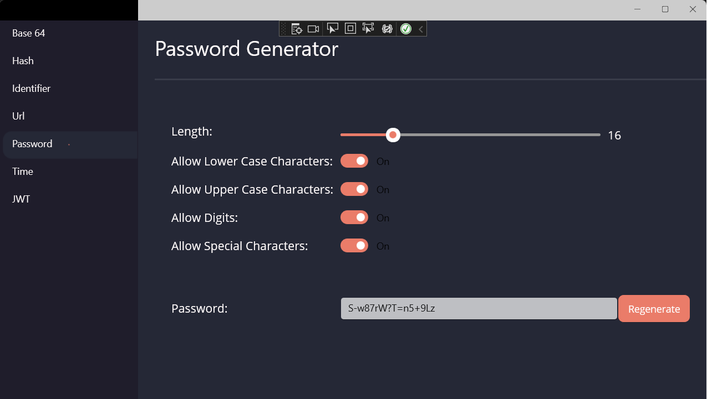
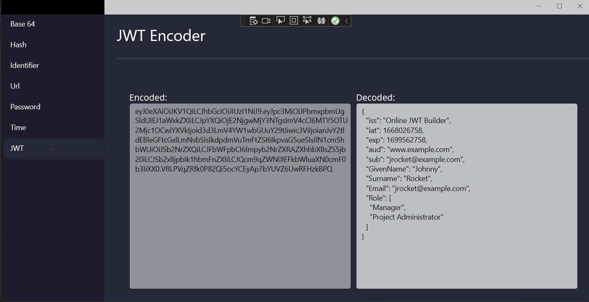
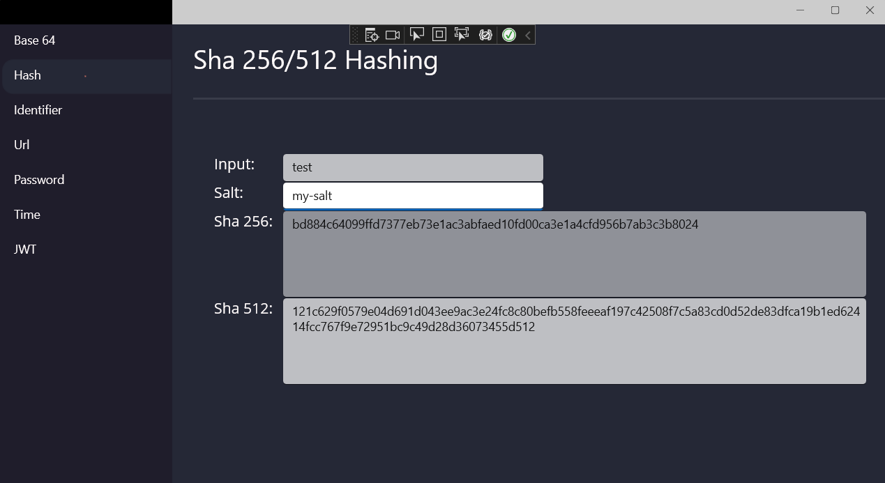

NOTE: I have found better tool that I not seen before. This tool is DevToys (https://github.com/veler/DevToys). So I decided to not re-invent the wheel.

# Simple Dev Utitilies for Every Day Use

  - Base 64 Decode/Encode
  - Sha256/Sha512 Generator (with/without salt)
  - Id Generators (Guid, Base32, Base54, Base64, Random)
  - Url Encode/Decode
  - Html Encode/Decode
  - Password Generator
  - DateTime/Epoch Converter
  - JWT Encoder
  
## Screenshots

